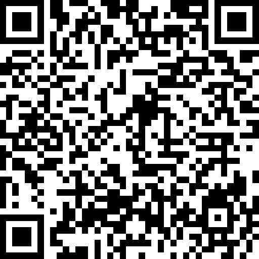

## [Back to OSHI](../)

# [OSHI-data](https://github.com/LafeLabs/OSHI/tree/main/OSHI-data)

The purpose of the data stored here is to share our science with as many people as possible as easily as possible.

Each [OSHI](../) shall have a specified data format which will be documented in a [README](../readme/) file and which is in [JSON](https://en.wikipedia.org/wiki/JSON) format, saved as a .txt file, with a time stamp in the file name as well as the name of the OSHI.  

The format should include as much metadata as possible, including a hyperlink back to the set of documents which replicate the whole OSHI system which created that file.  