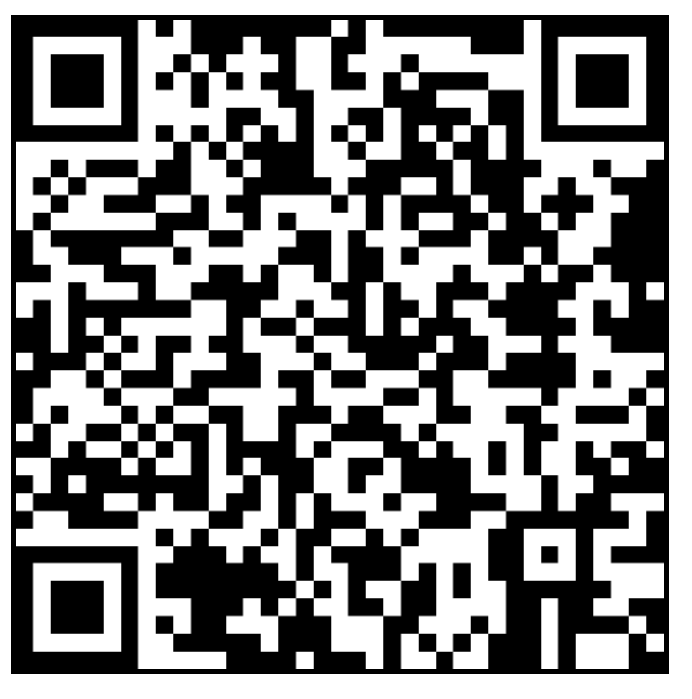

# [Open Source Hardware Instrument(OSHI)](https://github.com/lafelabs/OSHI)

 - [qrcode/](qrcode/)
 - [readme set reader](readme/readme-reader.html)
 - [readme set editor](readme/readme-editor.html)
 - [readme/](readme/)
 - [localhost/](http://localhost/)

The purpose of science instruments is to extend the shared nervous system of humanity. The purpose of the open source hardware instrument (OSHI) is to replicate science instruments as widely as possible, to navigate their evolution and improvement, and to coordinate the flow of information from the instruments out to the world. 

We break up the OSHI into as many fractal parts as needed so that each part can itself replicate. This is generally broken down by type into electrical, mechanical,  informational.  We build the documentation required not only to copy a thing but to copy it economically and at scale.  We build the social network infrastructure required to allow sponsors to pay for any number of instruments, which are then used by performers who use the instruments to gather and publish data. 

Each element of an open source hardware instrument must communicate why it exists and why a user would want to replicate it.  Each element links with the other elements in a network of hyperlinks in their documentation. Each element has its own sub directory with a README.md file and a QR code which links back to a global url on the open web which hosts that Readme. Each readme has a title linking back to itself. 

The OSHI code set itself is a minimal self replicating HTML document which displays the markdown in the README. it has that as an element.  The OSHI code repo follows its own plan. It is a fractal self replicating set. 

